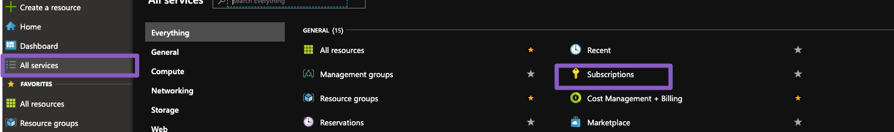
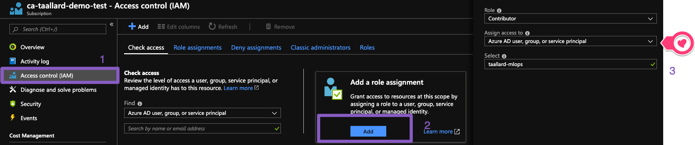
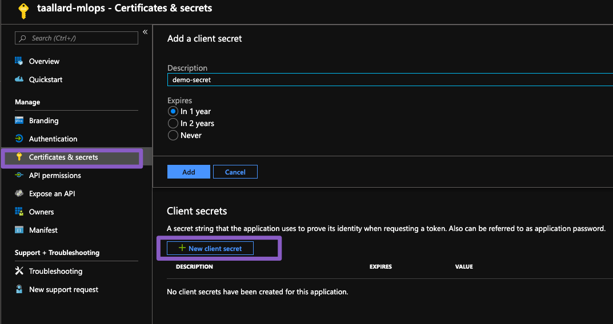
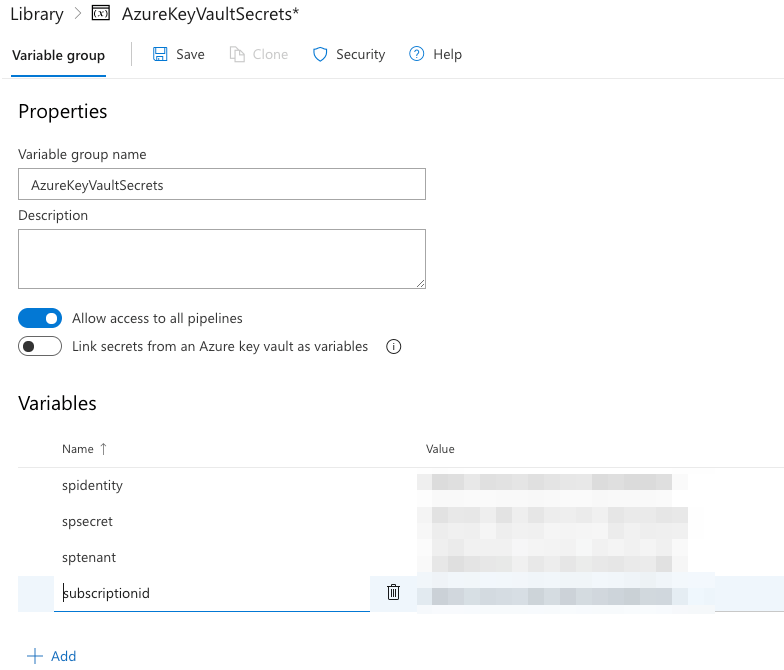

Additional setup 
===================

Azure DevOps
----------------

In addition to the pre-requisites sent to you, we will need to use Azure DevOps for the 
CI and CD (continuous integration and continuous delivery of our machine learning pipeline).

1. Got to `http://bit.ly/Azure-devops <http://bit.ly/Azure-devops>`_ and create an account 
2. Once registered, create a  new organisation

.. image:: ./_static/assets/new_org.png
    :alt:   new DevOps org 

When prompted to choose a location for your projects to choose the closest region to where you normally are.

3. Once completed you can sign into your organisation at any time through ``http://dev.azure.com/{your_org}``

4. Now we need to create a new project. Click on the *Create new project* button

.. image:: ./_static/assets/new_project.png
    :alt:   new DevOps org 

Enter the information on the form provided. If you need more details about choosing the right process head to `the relevant docs <https://docs.microsoft.com/azure/devops/boards/work-items/guidance/choose-process?view=azure-devops&WT.mc_id=mlops-github-taallard>` _.
For this project, we will choose the basic one.

Azure: create service principal and role access
-------------------------------------------------

The next step is to create a service principal for your resources. You might also want to check this tutorial's glossary to understand what this is (check :ref:`ServicePrincipal`
).

From the user interface
"""""""""""""""""""""""""

1. Log into Azure using `this link <https://azure.microsoft.com/?WT.mc_id=mlops-github-taallard>`_  and go to your portal
2. Search for **App registrations**

.. image:: ./_static/assets/app_reg.png
    :alt:   app registrations

3. Click on **New registration**

.. image:: ./_static/assets/new_reg.png
    :alt:   new registration

4. Complete the details (give this a memorable name). After this, you will have created your Azure Active Directory and a service principal.

The next step is to assign a role to your application. 
Why do you ask? 🤔

So that you can access different resources on your Azure subscription. We do this via :ref:`RBAC` or role-based access control.
The scope of the RBAC can be subscription, resource group, or resource and permissions are inherited to child scopes (see image).

.. image:: https://docs.microsoft.com/en-us/azure/role-based-access-control/media/overview/rbac-scope.png

5. We are going to assign subscription level access to our newly created service. Click on **All services > subscriptions** and choose the subscription you are using

6. Select **Access control IAM > Add role assignment** and fill in the form with the service principal created in 3.

Make sure to select Contributor access

7. Next, we need to create a secret. Go to **App registrations > Secrets > New client secret** and make sure to copy the key

From the command line
"""""""""""""""""""""""""

1. Log in to your Azure account 
::
    az login

2. Make sure you are using the correct subscription
::
    az account list --output table 
    # use this to select the subscription
    az account set --subscription "My subscription"

You can verify that this was set running
:: 
    az account list --refresh --output table

3. Create the service principal (make sure to give it a sensible name)
::
    az ad sp create-for-rbac \
    --name mlops-demo \
    --role contributor \
    --scopes /subscriptions/<subscription ID from above>

Make sure to copy the output of the operation
::
    {
        "appId": "------------------------",
        "displayName": "mlops-demo",
        "name": "http://mlops-demo",
        "password": "------------------------",
        "tenant": "------------------------"
    }

The fields appId, password and tenant are the required pieces of information. These should be copied into the "Service Principal App ID", "Service Principal App Key" and "Service Principal Tenant ID" fields in the form, respectively.

**Keep this information safe as the password cannot be recovered after this step!
Also they should be treated with loads of care as they give access to your account**

Storing Secrets
===================

This has to be done on Azure DevOps once you have created your project, the service principal and the role assignment.

The next step is to grant access to our pipelines.
For this we are going to use variable groups inside Azure DevOps (think of environment variables).
These will be readily accesible across multiple pipelines.

1. Click on **pipelines > library > + variable group**

2. Fill in the form with the values from the step above

``spidentity`` -> ``appId``

``spsecret`` -> ``password``

``sptenant`` -> ``tenandId``

``subscriptionid` -> ``subscriptionid``

Jupyter setup
=================

You need to enable the widgets for the explainable ML package.
Make sure to have your environment activated and from the command line:
::
    jupyter labextension install @jupyter-widgets/jupyterlab-manager
    jupyter labextension install microsoft-mli-widget