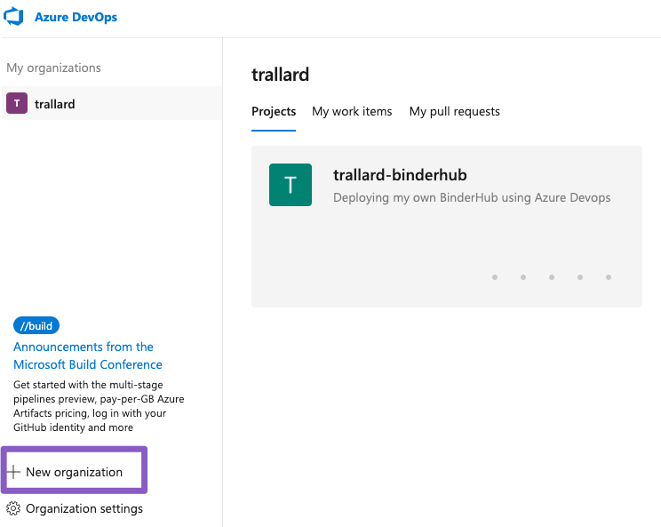
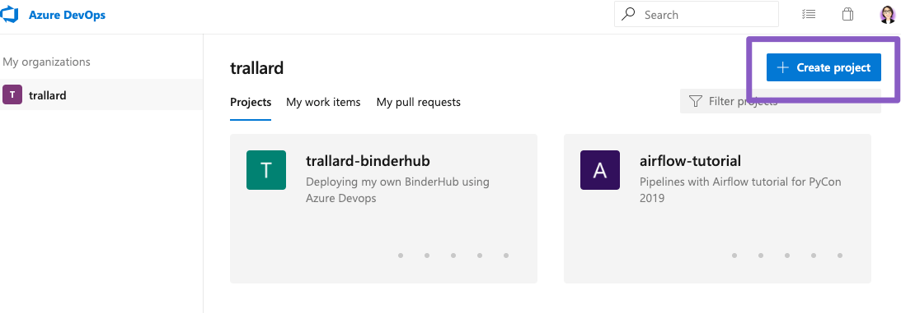
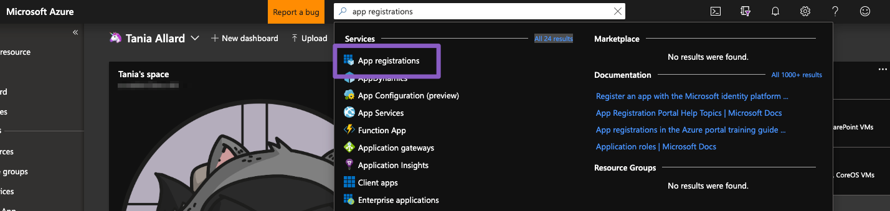
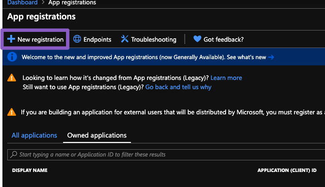

Additional setup 
===================

Azure Devops
----------------

In addition to the pre-requisites sent to you we will need to use Azure Devops for the 
CI and CD (continuous integration and continuous delivery of our machine learning pipeline).

1. Got to `http://bit.ly/Azure-devops <http://bit.ly/Azure-devops>`_ and create an account 
2. Once registered, create a  new organisation

When propmpted to choose a location for your projects choose the closest region to where you normally are.

3. Once completed you can sign into your organisation at any time through ``http://dev.azure.com/{your_org}``

4. Now we need to create a new project. Click on the *Create new project* button

Enter the information on the form provided. If you need more details about choosing the right process head to `the relevant docs <https://docs.microsoft.com/azure/devops/boards/work-items/guidance/choose-process?view=azure-devops&WT.mc_id=mlops-github-taallard>`_ .
For this project we will choose the basic one.

Azure additional setup
-------------------------

The next step is to create a service principal for your resources. You might also want to check this tutorial's glossary to understand what this is (check :ref:`ServicePrincipal`
).

From the user interface
"""""""""""""""""""""""""

1. Log into Azure using `this link <https://azure.microsoft.com/?WT.mc_id=mlops-github-taallard>`_  and go to your portal
2. Search for **App registrations**

3. Click on **New registration**

4. Complete the details (give this a memorable name). After this you will have created your Azure Active Directory and a service principal.

The next step is to assign a role to your application. 
Why you ask? 🤔

So that you can access different resources on your Azure subscription. We do this via :ref:`RBAC` or role based access control.
The scope of the RBAC can be subscription, resource group, or resource and permissions are inherited to child scopes (see image).

.. image:: https://docs.microsoft.com/en-us/azure/role-based-access-control/media/overview/rbac-scope.png

